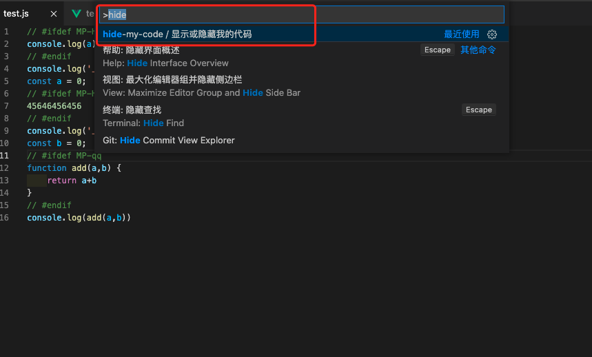
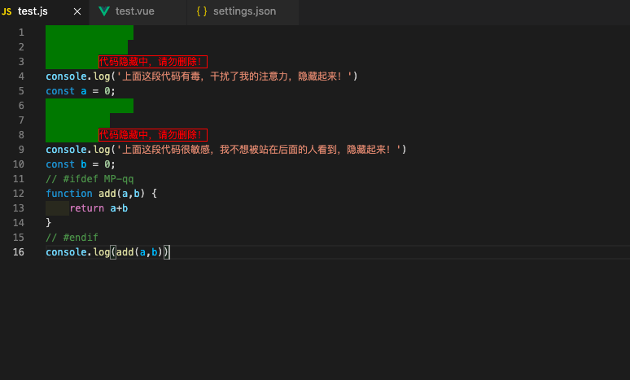
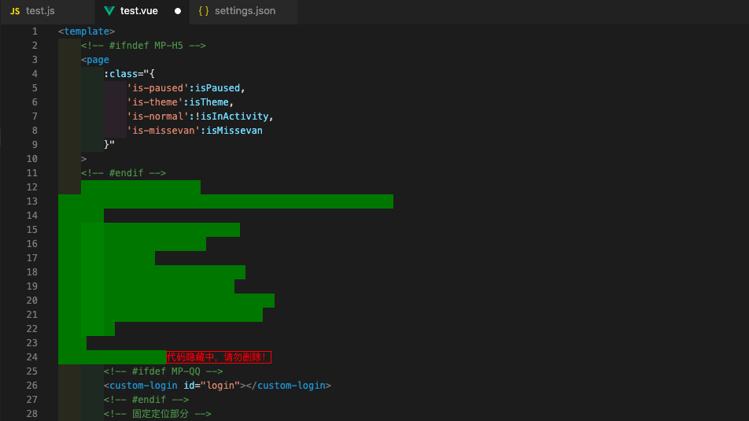

# hide-my-code README

### ·我有些代码想隐藏起来，老有人站我后面，我不想让他看！
### ·我有些代码想隐藏起来，但是折叠满足不了，比如一些特殊格式的注释！
### ·我有些代码想隐藏起来，只是隐藏，源代码不用改变！

## pick me

## example



## 配置方法
将想要隐藏的代码当成字符串，并放在hideList字段中，支持正则：

``` js
// setting.json
// 配置项：
"hide-my-code":{
    // 匹配到的会被隐藏起来
    "hideList": [
        "//( )?#ifdef MP-H5(.|[\r\n])*?// #( )?endif",
        "<!-- #ifdef MP-H5 -->(.|[\r\n])*?<!-- #endif -->",
    ],
    // 遮罩的颜色
    "bgColor":"green",
    // 此处可配置其他的属性
    "style":{
        "after": {
			"contentText": "代码隐藏中，请勿删除！",
			"color": "red",
			"border": "1px solid red"
		}
    }
}
```
## 使用方法
命令行执行：（command+shift+p  -> 输入下面的命令  ->  回车 ）
``` shell
hide-my-code / 显示或隐藏我的代码
```

